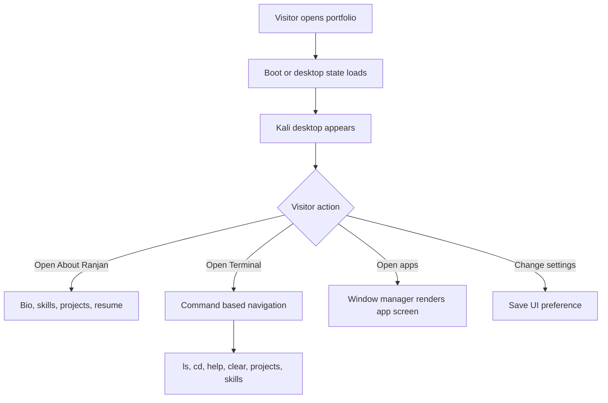
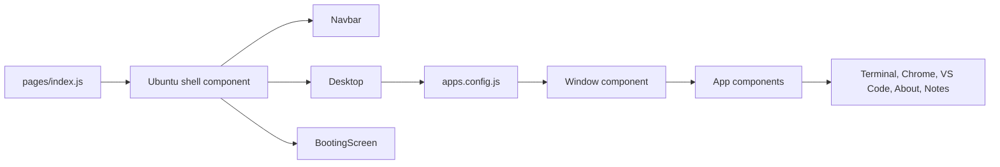

<div align="center">

# Kali Portfolio

[](https://nextjs.org/)
[](https://react.dev/)
[](https://tailwindcss.com/)

A Kali Linux themed interactive portfolio with a desktop, dock, draggable app windows, terminal commands, and personal project sections.

[Live site](https://www.ranjansharma.name.np/) | [GitHub repo](https://github.com/Konseptt/Kali-portfolio)

</div>

## Why I built this

I wanted a portfolio that matches my interest in Linux, cybersecurity, and hands-on tooling. Instead of a normal page with cards, this version behaves like a desktop. You can open apps, use a terminal, read about me, view projects, and explore a small Kali inspired environment.

This repo is also where I experimented with improving the older Ubuntu-style portfolio into something more personal.

## What it includes

- Kali themed boot screen, wallpaper, icons, and terminal
- Desktop shortcuts and favorite apps
- Draggable windows with focus, close, and minimize style behavior
- About, skills, education, projects, and resume views
- Terminal commands for navigating folders like `projects`, `skills`, `languages`, and `interests`
- Extra apps like notes, weather, calendar, file manager, and chat
- Static export output in `docs/` for GitHub Pages style hosting

## Live website flow



## Architecture diagram



## Tech stack

| Layer | Tools |
|---|---|
| Framework | Next.js |
| UI | React |
| Styling | Tailwind CSS, custom CSS |
| Interactions | react-draggable, localStorage |
| Utilities | jQuery, expr-eval, react-virtualized |
| Forms and links | EmailJS, embedded iframes |

## Run locally

```bash
npm install
npm run dev
```

Then open:

```text
http://localhost:3000
```

Build:

```bash
npm run build
```

## Note

The project still carries some Ubuntu naming in component files because it grew from an Ubuntu desktop portfolio base. The user-facing theme here is Kali inspired, and the personal content is customized around my own profile.
